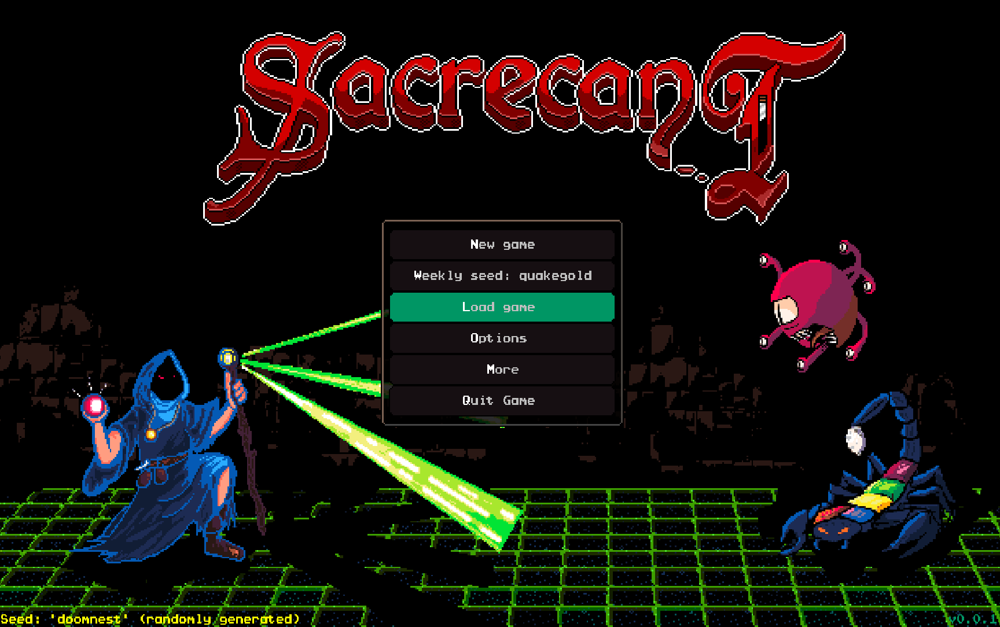
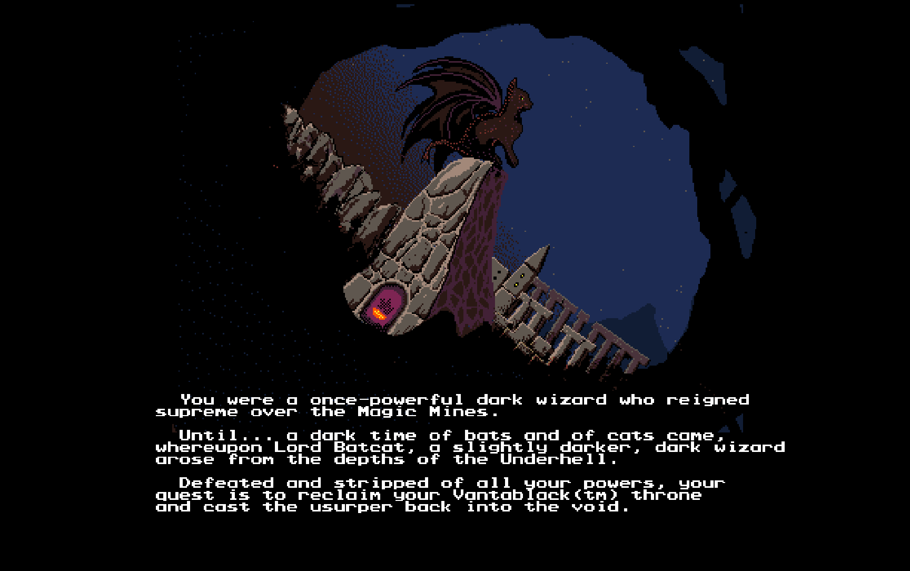
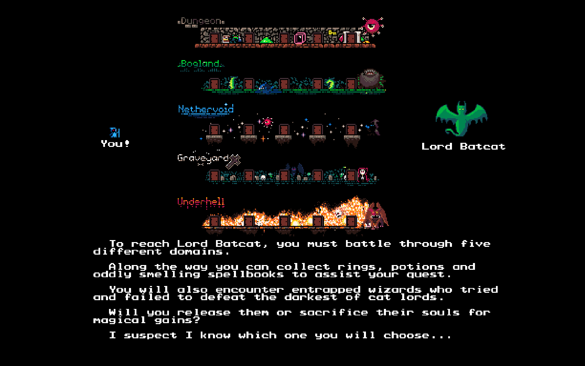
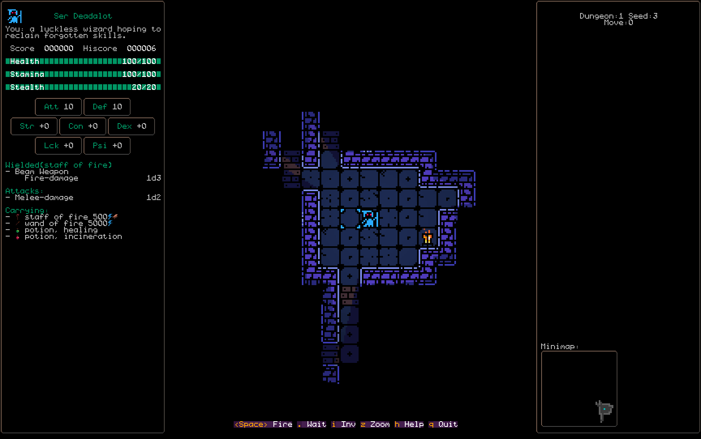
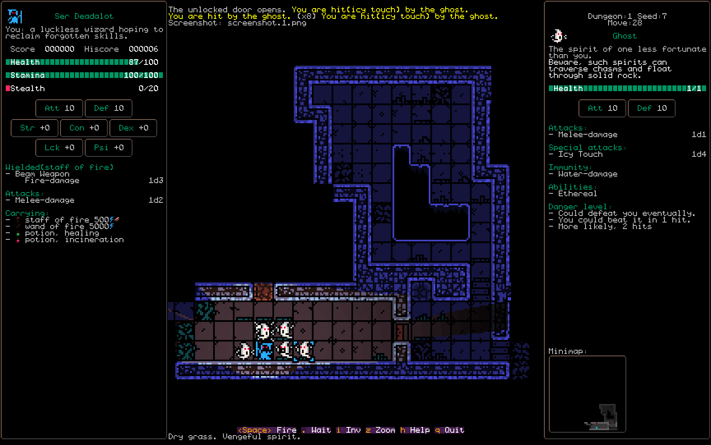

Currently playable and seeking feedback (goblinhack _at_ gmail _dot_ com)

No bosses yet, current status is adding content.

Music
-----
- Main music by the amazing C.E.McGill and
- Markus Heichelbech (deceased senior technician): [found here](http://nosoapradio.us)
<!-- and https://drive.google.com/drive/folders/0B_fD62tSeGaVRlBaZWJwS29JSnM -->

Sound effects
-------------
- 8 bit sounds [found here](https://soundsbydane.itch.io/8-bit-sound-pack)
- Bogland ambience [found here](https://freesound.org/people/Patrick_Corra/)
- Dungeon ambience [found here](https://freesound.org/people/Sclolex/)
- Falling sound [found here](https://freesound.org/people/nomiqbomi/)
- Footstep by Rico Casazza [found here](https://freesound.org/people/Rico_Casazza/)
- Graveyard ambience [found here](https://freesound.org/people/phoenixsoftware/)
- item collect [found here](https://freesound.org/people/mrickey13/)
- Leaves rustling sound [found here](https://freesound.org/people/AardsReal/)
- Monster death by Michel88 [found here](https://freesound.org/people/Michel88/)
- Nethervoid ambience [found here](https://freesound.org/people/Sonicfreak/)
- Oof sound buy xtragmr [found here](https://freesound.org/people/xtrgamr/)
- Shatter sound [found here](https://freesound.org/people/ccen18/)
- Slime by Konstati [found here](https://freesound.org/people/konstati/)
- Slime by wubitog [found here](https://freesound.org/people/wubitog/)
- Slime by Zuzek06 [found here](https://freesound.org/people/Zuzek06/)
- Underhell ambience [found here](https://freesound.org/people/looplicator/)
- Water splash by launemax [found here](https://freesound.org/people/launemax/)
- Fire sounds based on work by VlatkoBlazek [found here](https://freesound.org/people/VlatkoBlazek/)
- Rock grind sounds based on work by guterton [found here](https://freesound.org/people/guterton.wav/)
